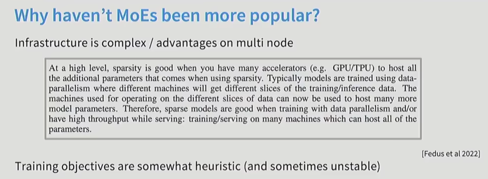
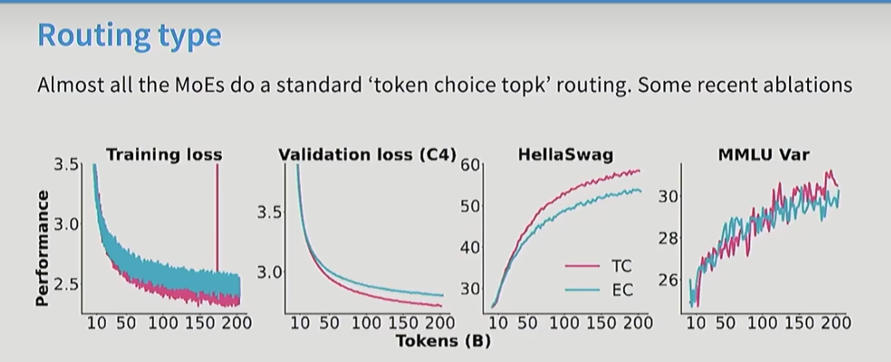
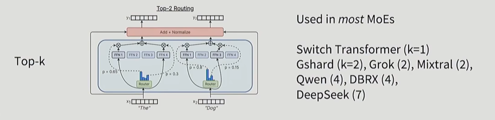
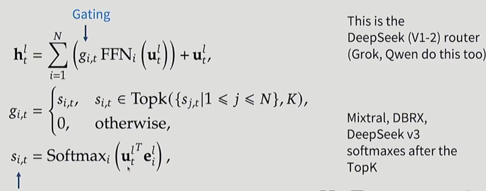
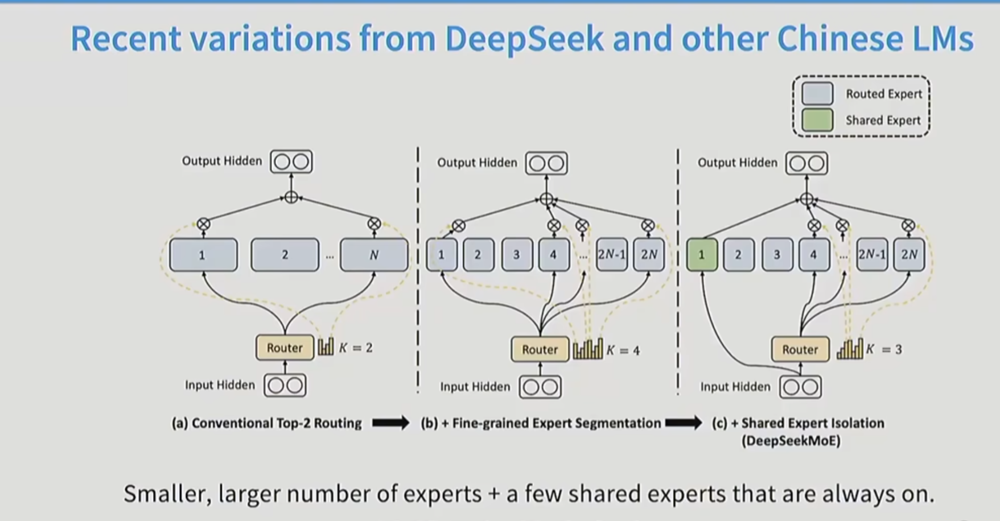

# Mixture of Experts (MoE)

> deepseek，Qwen,llama4
dense architecture: 

首先，我么有一个最简单的transformer模型，X经过self-attention, 然后经过Add+Norm(residual connection)，最后经过一个前馈网络（feedforward network），最后再经过一个残差连接。得到输出Y。

这是一个dense architecture，因为每个输入都经过了所有的计算。

而对于Mixture of Experts (MoE)模型，我们有多个专家（expert），每个专家都是一个前馈网络（feedforward network）。我们通过一个门控机制（gating mechanism）来选择哪些专家参与计算。

也就是，将一个大的FFN，拆成多个小FFN。但是并没有改变FLOPs的数量，因为矩阵乘法的FLOPs是由输入和输出的维度决定的。我们称这种架构为sparse architecture，因为每个输入只经过了部分计算。

> MoE可以减少test loss而不增加FLOPs，专家数越多，test loss越小。但随着专家数的增加，内存开销增大，将数据交给特定专家的门控机制也变得更加复杂。
> 一个比较简单的控制是expert parallelism，即把token传到不同设备上的专家上进行计算。这样可以减少内存开销，但会增加通信开销。
> Qwen1.5把MoE应用在初始的Dense Architecture上.

> 只有在split up model的情况下，也就是不得不分片处理模型时，MoE才最具有优势。

## Routing function(路由函数)

### Top-k routing
- token chooses：选择k个专家
- expert chooses：每个专家根据输入选择
- global routing：全局路由机制

MLP routing：使用一个多层感知机（MLP）来计算每个专家的权重，然后选择权重最高的k个专家。

> token choose 的k为1时，仅仅选择1个专家，会丧失一些性能。通常k的值为2或4，可以在性能和计算效率之间取得平衡。

> common baseline: hashing-based routing：使用哈希函数将输入映射到专家上，也能达到不错的性能提高，常被用作基线方法。

> RL-based routing：使用强化学习来训练一个路由器。RL非常善于处理离散决策问题(discrete decision-making)，可以学习如何在不同专家之间进行选择。但是成本高于收益，且有时不稳定。 
> linear assignment routing：将输入线性分配给专家，简单但可能不够灵活。

#### detail Top-k routing

Softmax 计算每个专家的权重，然后取消top-k以外的权重，最后进行归一化。

#### shared expert isolation

专家维度减小，数量增加(fine-grained experts)，保持总的参数量不变。加上几个一直参与计算的专家（shared experts），来保证模型的稳定性。

#### 消融实验（ablation study）

去掉shared experts，性能下降明显。说明shared experts对于模型的稳定性和性能提升非常重要。

Gshare作为基线，是一个非常简单的MoE架构。

分别设置的是：（out of 是topk 的数量）
- 0 shared expert + 2 out of 16 routed experts(GShared): 只有2个专家参与计算，没有shared experts。
- 1 shared expert + 1 out of 15 routed experts(+shared expert isolation): 1个shared expert参与计算，另外1个专家从剩下的15个专家中选择。

## Expert size

## training
