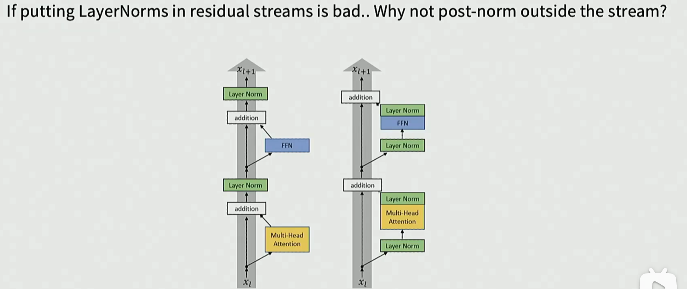

# transformer

## pre vs post layer norm
几乎所有的transformer模型都使用pre layer norm，也就是在每个子层（self-attention和feedforward network）之前进行layer normalization。

### double norm

前后都进行layer normalization，虽然可以提高模型的稳定性，但会增加计算成本。



residual path上进行layer normalization: residiual path上的值是identity connection mapping的结果，也就是说，可以在全network layers上一贯地进行layer normalization，而不需要担心梯度消失的问题。

### softmax - 提升稳定性

logits <- soft_cap * tanh(logits/soft_cap)

QK Norm: 是指在计算self-attention时，对查询（Q）和键（K）进行归一化处理，以提升模型的稳定性和性能。通过对Q和K进行归一化，可以使得它们的值更集中，减少数值不稳定性，从而提高模型的训练效果和泛化能力。

### GQA/MQA


``` python