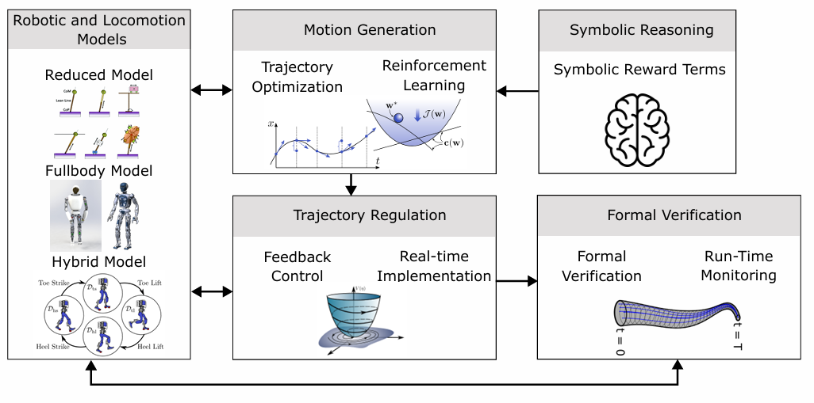
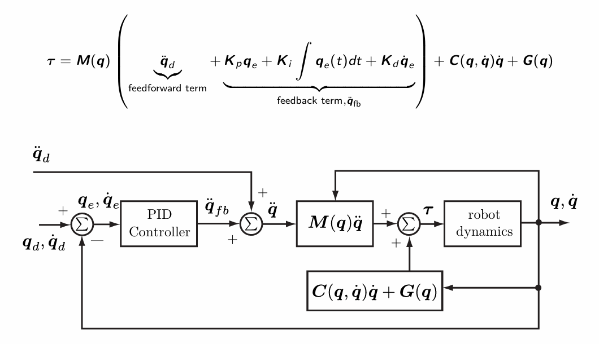
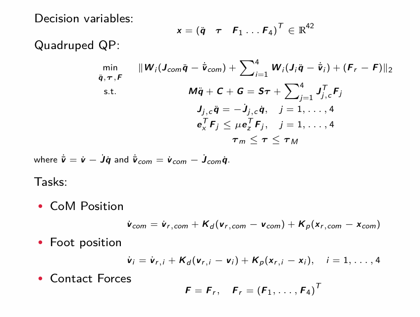
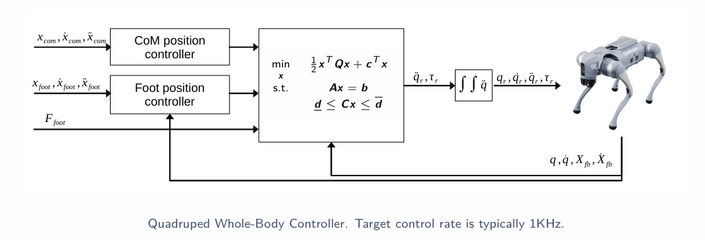

[joint space control](#joint-space-control)

-------------------

# lec10

#### joint space control

Control is formulated directly on joint coordinates `q`.

- gravity compensation based controllers (pure, ***PID***+GC,***PD***+GC)
    - zero steady‑state error for PID
- computed torque control
    - Useful when the mass–inertia matrix M(q) is not well approximated by a diagonal matrix.
    - uses the full rigid-body model τ = M(q)[q̈_d + K_d ė + K_p e] + C(q,q̇)q̇ + g(q), yielding linear, decoupled error dynamics ë + K_d ė + K_p e = 0 → feedback linearization. Tracks trajectories but requires an accurate dynamic model.

#### task space control

Control is formulated in end-effector / task coordinates `x`.
> OSC(Operational Space Control)

#### WBC(Whole Body Control) as QP(Quadratic Program)
Modern frame casts instantaneous stabilization as an online Quadratic Program solved at ~1 kHz:

- Decision variables: joint accelerations q̈, torques τ, contact forces λ.
- Cost: weighted sum of task accelerations (CoM, swing-foot, posture …).
$Σᵢ ‖Jᵢ q̈ + J̇ᵢ q̇ − ẍᵢ*‖²_{Wᵢ}$ 
- Constraints (now first-class citizens, unlike closed-form WBC):

>... how WBC emerged from task space control
... how we can model different robot tasks and constraints in WBC
... how to setup a code example with a quadruped

------------------------

how to keep a system near a desired state or trajectory in the presence of disturbances, model errors, and contact switches.

# lec 12

## **Part 1 — MPC Fundamentals（MPC 基础）**  
*(Receding-horizon principle, direct multiple shooting, LP⊂QP⊂Convex⊂NLP, terminal ingredients)*

**1. Receding-Horizon Principle（滚动时域原理）**  
**EN:**  
MPC solves a finite-horizon optimal control problem at each time step, applies only the first control input, then shifts the horizon and solves again. This makes MPC robust to disturbances, modeling errors, and non-optimality.

**CN：**  
MPC 在每个时刻求解一个**有限时域最优控制问题**，只执行第一个控制量，然后**滚动时域**重新规划。  
这种机制使系统能自动修正误差、应对扰动，并保持稳定。  

**Key steps（关键步骤）:**  
1. Measure current state（测量当前状态）  
2. Solve finite-horizon OCP（求解有限时域 OCP）  
3. Apply first input \(u_0^\*\)（执行第一个控制量）  
4. Shift horizon and repeat（滚动时域重复）

**2. Direct Multiple Shooting（直接多重射击法）**  
**EN:**  
The standard transcription method in MPC. It discretizes the horizon and treats all states and inputs as decision variables, enforcing dynamics via equality constraints.

**CN：**  
MPC 中最常用的离散化方法。将时域分成多个区间，把所有状态与控制量作为决策变量，通过等式约束强制满足动力学。

**Form:**  
- Decision variables: \(\{x_0,\dots,x_N\}, \{u_0,\dots,u_{N-1}\}\)  
- Dynamics: \(x_{k+1} = f_d(x_k, u_k)\)（由 RK4 等积分器得到）

**3. Class Hierarchy: LP ⊂ QP ⊂ Convex ⊂ NLP（问题类别层级）**

**LP（线性规划）**  
- Linear dynamics, linear cost, polyhedral constraints  
- Fastest, globally optimal  
- Robotics 中较少使用  

**QP（二次规划）**  
- Linear dynamics + quadratic cost  
- Most common in robotics MPC（如 SRBD MPC, WBC QP）  
- Still convex → global optimum  

**Convex MPC（凸 MPC）**  
- Convex dynamics/cost/constraints  
- Includes QCQP  
- Any local optimum is global  

**NLP（非线性规划）**  
- Nonlinear dynamics or constraints  
- Only local optima  
- Hardest to solve in real time  

 
> “The great watershed is convexity vs nonconvexity.”  

**4. Terminal Ingredients（终端项：稳定性与可行性）**

**Why needed?（为什么需要？）**  
Finite-horizon MPC **does not automatically** guarantee stability.  
必须确保：  
- **Recursive feasibility（递归可行性）**：下一步仍可行  
- **Asymptotic stability（渐近稳定）**：闭环收敛到目标  

 **How to guarantee?（如何保证？）**  
1. **Terminal cost \(V_f(x_N)\)**  
   - 通常选 LQR 的无限时域代价  
2. **Terminal set \(X_f\)**  
   - 控制不变集（invariant set）  
3. **Terminal controller（终端控制器）**  
   - 如 LQR 增益 \(K\)

**Double integrator example（双积分器示例）:**  
没有终端集 → MPC 会把状态推入“危险区”并最终不可行。  
加入 \(X_f \subseteq X_\infty\) → 保证可行性与稳定性。  

## **Part 2 — MPC Over Contacts（接触中的 MPC）**  
*(Hierarchical vs Contact-Implicit)*

**1. Hierarchical MPC（分层式 MPC）**  
**EN:**  
This is the mature, widely deployed approach in legged robots (Mini Cheetah, ANYmal, HRP…).  
Contact schedule is predefined; MPC and WBC solve convex QPs.

**CN：**  
这是目前工业界最成熟、最常用的方法（Mini Cheetah、ANYmal、HRP 等）。  
接触序列由上层规划器给定，MPC 与 WBC 都是凸 QP，实时性强。

**Hierarchy（层级结构）:**  
1. **Gait / Footstep planner（步态/落脚点规划）**  
2. **SRBD convex MPC（简化刚体模型的凸 MPC）**  
3. **Whole-body controller (WBC)（全身控制 QP）**

**Pros（优点）:**  
- 实时性强  
- 稳定可靠  
- 已在多种机器人上部署  

**Cons（缺点）:**  
- 无法自动发现新接触  
- 需要手动设计接触序列  

**2. Contact-Implicit MPC（隐式接触 MPC）**  
**EN:**  
The MPC discovers contacts automatically.  
Harder optimization: MIQP/MINLP or MPCC.

**CN：**  
MPC 自动决定何时接触、何时离地。  
优化问题更难：MIQP/MINLP 或 MPCC。

**A. MIQP / MINLP（混合整数 MPC）**  
- Binary variables represent contact on/off  
- Big-M constraints enforce complementarity  

**Pros:** 自动发现接触  
**Cons:** NP-hard，实时性差  

**B. MPCC（互补约束优化）**  
- 用互补约束替代二元变量  
- 非光滑、非凸  
- 可用 IPOPT/SNOPT 求解  

**Pros:** 连续化、可微  
**Cons:** 无全局保证、对初值敏感、实时性差  

**3. Comparison（对比总结）**

| Aspect（方面） | Hierarchical MPC（分层式） | Contact-Implicit MPC（隐式接触） |
|---|---|---|
| Contact schedule | Predefined（预先给定） | Discovered by MPC（自动发现） |
| Optimization | Convex QP | MIQP / MINLP / MPCC（非凸） |
| Real-time | Excellent | Hard |
| Deployment | Industry standard | Research |
| Flexibility | Low | High |

**一句话总结：**  
- **分层式 MPC = 工程可用、实时可靠**  
- **隐式接触 MPC = 灵活强大，但计算困难**
