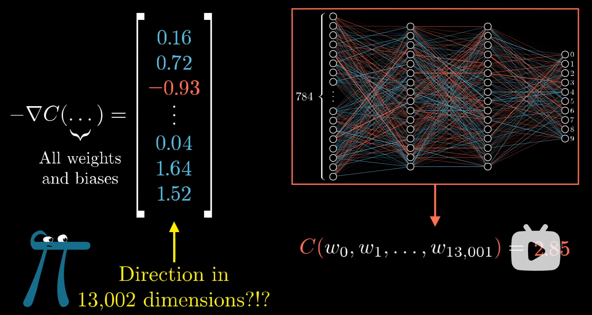
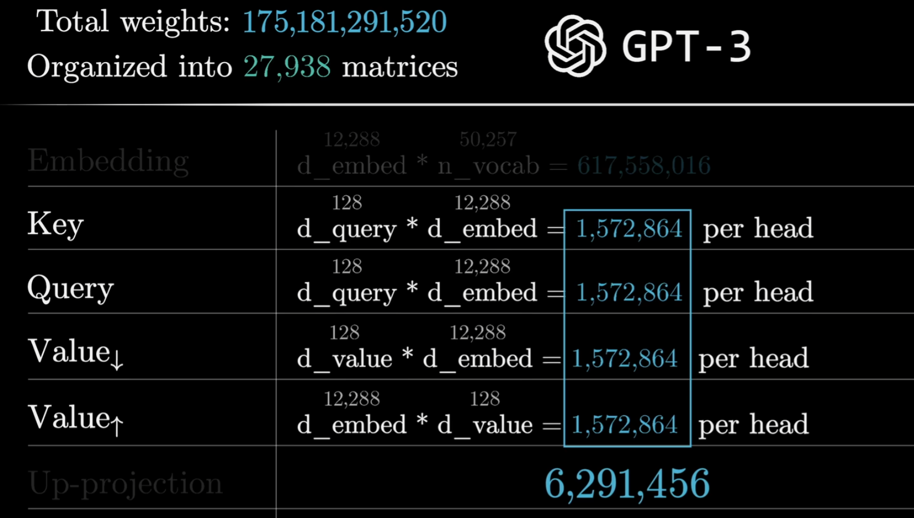
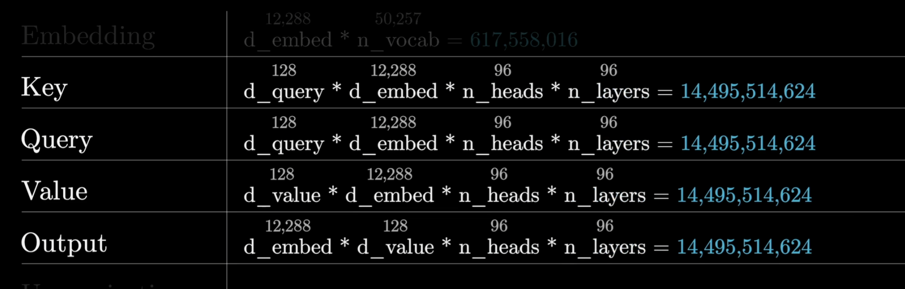

# 1 neural networks

neuron: [0,1]的activation function, 通过权重和偏置进行线性变换后输入激活函数，输出一个值。

> Q: 为什么layer能够表示智能呢？

子模式的识别。希望每一层符合特定模式的输入能够激活特定的神经元，从而形成对输入数据的抽象表示，进而输入下一层，最终形成对输入数据的高层次理解。

bias: 调控激活的难易程度，增加了模型的灵活性和表达能力。

#  2 梯度下降法 gradient descent & backpropagation

反向传播：单个训练样本想怎样修改权重与偏置（逐层向前传播），以减少损失函数的值。

Backpropogation is the algorithm for determining how a single training example would like to nudge the weights and biases, what relative proportions to those chages cause the most rapid decrease to the cost.

minibatch: 每次更新权重和偏置时使用的训练样本数量。较小的minibatch可以提供更频繁的更新，可能有助于模型更快地收敛，但也可能导致训练过程中的噪声增加。较大的minibatch可以提供更稳定的梯度估计，但可能需要更多的内存资源。

反向传播收敛到局部最小值：由于神经网络的损失函数通常是非凸的，反向传播可能会收敛到局部最小值，而不是全局最小值。

# Generiative Pre-trained Transformer

## GPT 3 的结构： 175B， 27000+ matrices

- Embedding matrix：W_E

Total parameters = tokens * embedding dimension = 6B

- context size: 2048

预测下一个token时，模型会考虑前面最多2048个token的信息。

- Unembedding matrix: W_U

6B parameters

- softmax & temperature

softmax: 将模型的输出转换为概率分布，使得每个token的预测概率在0到1之间，并且所有token的预测概率之和为1。

temperature: e^x/T in softmax. T = 0就只有一个token的概率为1，T = 1就是正常的softmax，T > 1会使得概率分布更加平坦，增加小概率样本的预测概率。

