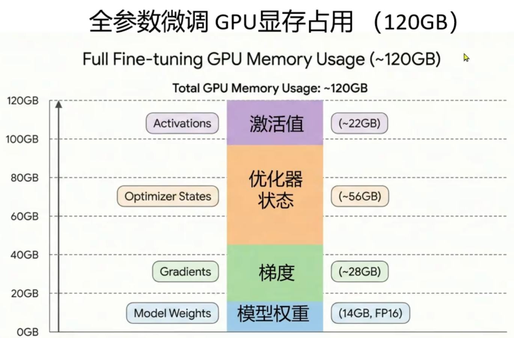
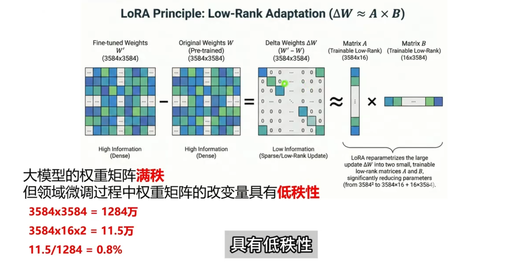
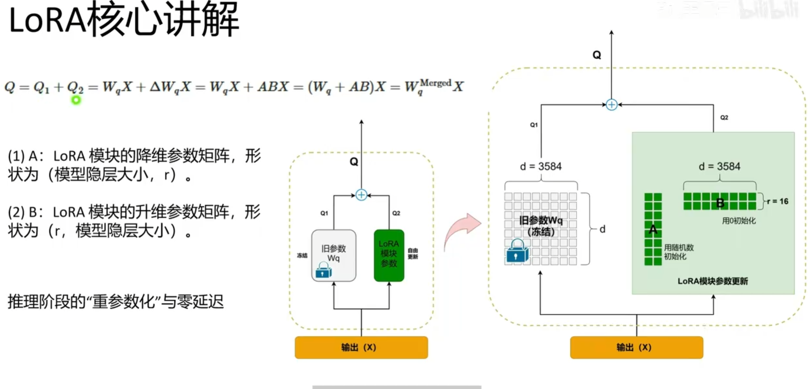
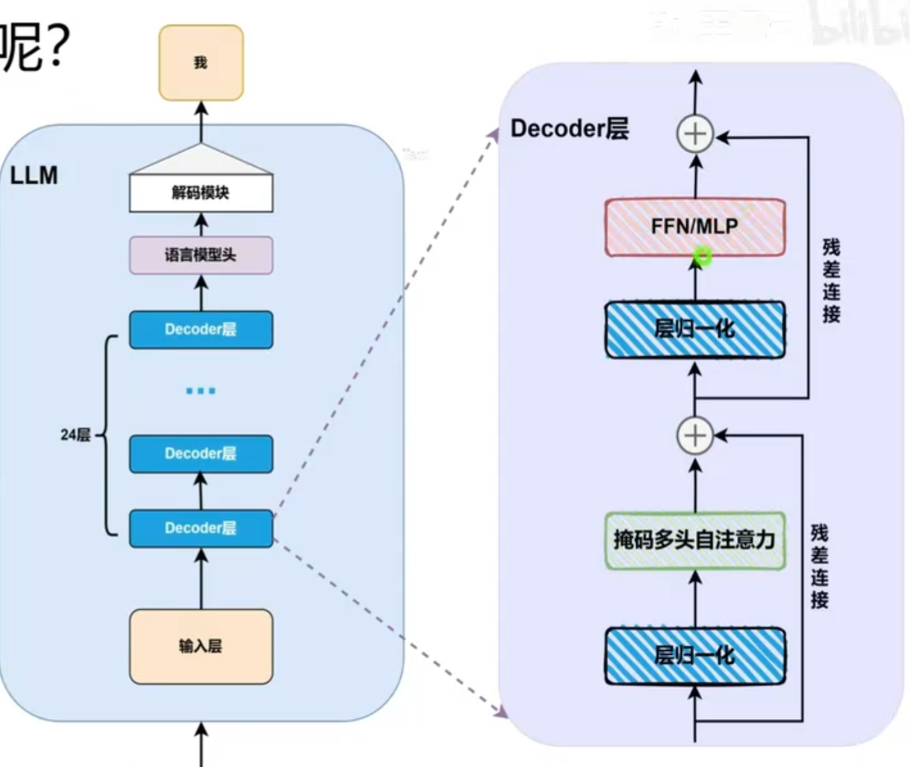
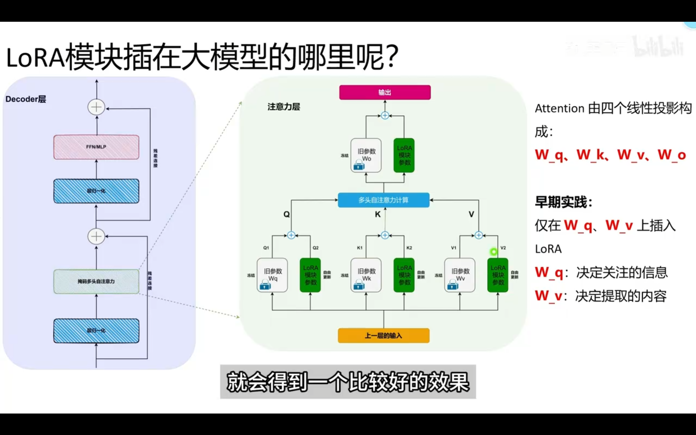
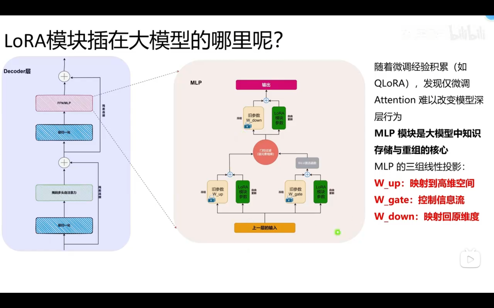
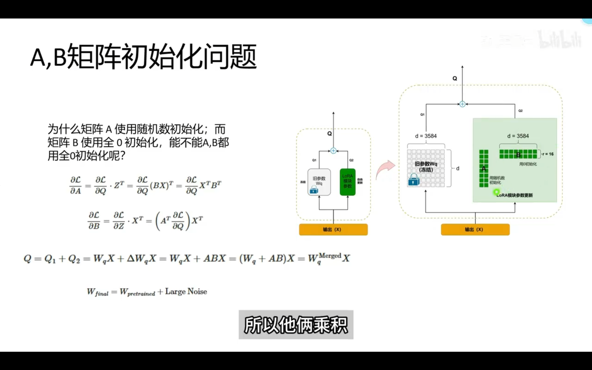

 # LoRA: low-rank adaptation of large language models

 7B: 7 billion parameters
 FP16: 16-bit floating point precision = 2 bytes
 1 bytes = 8 bits
 7B parameters * 2 bytes/parameter = 14 GB

以上，加载这个模型需要大约14 GB的内存。

## rank

代表了矩阵中线性无关的行或列的数量。

## LoRA模块的大模型结构

主流大模型均采用了Transformer Decoder-only架构：由24层decoder堆叠而成，各层结构高度一致。

### decoder架构：

层归一化（Layer Normalization）通过对每个输入样本的特征进行归一化处理，使得每个特征在训练过程中具有相似的分布，从而减少了内部协变量偏移（internal covariate shift）。

掩码多头自注意力（Masked Multi-Head Self-Attention）机制允许模型在处理序列数据时关注不同位置的信息，同时通过掩码机制确保模型只能关注当前时间步之前的信息，避免了信息泄露。

残差连接（Residual Connection）通过将输入直接添加到输出中，帮助缓解深层网络中的梯度消失问题，使得模型更容易训练。

前馈网络（Feed-Forward Network）由两个线性变换和一个**非线性**激活函数组成，负责对每个位置的特征进行进一步的处理和变换。

MLP（Multi-Layer Perceptron）是前馈网络的一种实现方式，通常包含一个隐藏层和一个输出层，通过**非线性**激活函数连接起来，用于增强模型的表达能力。

非线性也就意味着，输入和输出之间的关系不是简单的线性关系，而是通过某种非线性函数（如ReLU、Sigmoid等）进行变换，使得模型能够捕捉更复杂的模式和关系。真正进行了知识重组。

### 微调，发生在

#### W_Q 和 W_V 上

常见于风格变化。

#### MLP

随着微调经验积累，发现仅微调Attention难以改变模型的深层行为。

MLP模块是大模型中只是存储与重组的核心。

MLP的三组线性投影：

>W_up:映射到高维空间。
W_gate:控制信息流动的门控机制。
W_down:将高维空间映射回原始维度。

当任务涉及到复杂推理、代码生成等时，MLP模块的作用尤为重要。

#### ALL Linear

仅作用于Attention -> all linear，即并非微调全部参数而是在所有线性层插入LoRA.

> Attention: W_Q, W_K, W_V, W_O
> MLP: W_up, W_gate, W_down

*任务复杂、推理与知识重组要求高：All-linear*
*任务简单、显存受限：仅微调Attention*

 

## Question

### LoRA 初始化：矩阵A,B怎么初始化？

1. 开始的时候，A X B = 0，即A和B的乘积为零矩阵。这样，前向传播时，LoRA模块的输出为零，不会对原始模型的输出产生影响。（*前向传播，是指输入数据通过模型进行计算，最终得到输出的过程。在这个过程中，数据从输入层经过隐藏层，最后到达输出层。*）

2. A和B的元素可以随机初始化，但需要满足A X B = 0的条件。这通常通过将A初始化为小的随机值，B初始化为零矩阵来实现。

3. 第一次反向传播时，A的值不变（因为B^T是零矩阵），而B的值会根据损失函数的梯度进行更新。随着训练的进行，A和B都会逐渐调整，使得LoRA模块能够学习到有用的特征表示。（*反向传播，是指在训练过程中，模型根据损失函数的梯度来更新参数的过程。通过计算损失函数相对于模型参数的梯度，模型能够调整参数以最小化损失，从而提高性能。*）

## LoRA实操

### llama factory