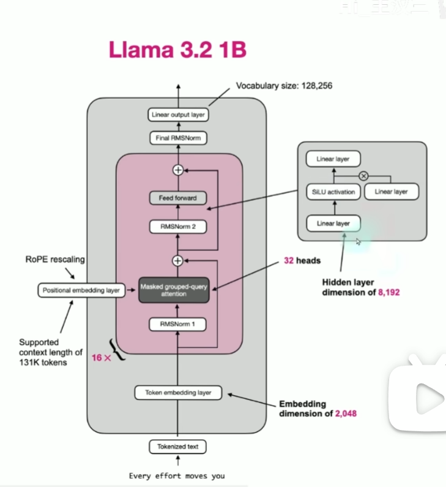

# Modules

## Overall architecture

## embedding

PAD: 使所有输入序列具有相同长度的特殊标记。
SOS: 序列开始标记，表示输入序列的开始。
EOS：序列结束标记，表示输入序列的结束。

怎么把句子转换成向量？embedding就是把离散的单词映射到连续的向量空间中。

- 低维度d：频率高，变化快 → 区分近距离的位置（第1个词 vs 第2个词）
- 高维度d：频率低，变化慢 → 区分远距离的位置（第1个词 vs 第100个词）
## QKV

自注意力：其实是每个token依次和其他token相乘。如果是两个不同的矩阵相乘，那就是两个句子的语义相似度，越大越相似。

Q : Query, 想找的上下文
K : Key, 上下文的标识，用来匹配Q, 表示提供的信息类型
V : Value, 上下文的内容，真正提供的语义内容——当 Query 发现某个 Key 很匹配时，它就会把对应的 Value 提取出来，融入到当前的语义表示中

Attention = softmax(QK^T / sqrt(d_k))V

QK^T / sqrt(d_k) 是一个相似度矩阵，表示每个token与其他token的相似度。然后通过softmax函数将相似度矩阵转换为权重，最后乘以V得到最终的输出。

这其中，QK^T 的含义是：对于每个token的Query，计算它与所有token的Key的相似度。这个相似度可以理解为每个token与其他token的关系强弱程度。（i，j）表示的就是第i个token关注第j个token的程度，还是数值越大，说明第i个token越关注第j个token。

然后通过除以sqrt(d_k)进行缩放，防止相似度过大导致softmax函数的梯度消失问题。

然后通过softmax函数将这些相似度转换为权重。

再与V乘回去，V的维度由其他方式决定，来表示不同维度的语义特征。最终得到的结果是V的维度，如图。经过整个处理后，每个token都得到了自己和其他token的关系权重，并且通过这些权重对V进行加权求和，得到最终的输出。

整个得出的矩阵就是`注意力得分矩阵`

## 缩放点积注意力

对于图中的公式，从数学角度来看，如果输入的点积值过大，$ softmax = \frac{e^{x_i}}{\sum_j e^{x_j}} $ 不是趋近1就是趋近0，导致梯度消失。

通过除以 $\sqrt{d_k}$ 进行缩放，可以缓解这个问题。

## 多头注意力机制

每个头学习不同信息。
一般是8个头，每个头的维度是512/8=64

## FFN

$$FFN(x) = RELU(xW_1 + b_1)W_2 + b_2$$

# Transformer

## characteristics

1. 它让序列里每个位置都能直接关注其他位置
2. 它可以并行训练
3. 它更容易被扩展到超大数据、超大参数、超大算力

与RNN相比，RNN从第一个token串行到最后一个，需要依赖前一个token的输出，而Transformer通过自注意力机制让每个token都能直接关注其他token，打破了序列的限制。

RNN 还有一个经典问题：  一句话太长时，前面的信息传到后面，容易越来越弱。

而CNN虽然可以并行训练，但它只能关注局部信息，无法捕捉长距离依赖。

### 基于transformer的模型

**BERT**：双向编码器，同时看左边和右边上下文，主要用于理解任务（encoder-only），比如分类、抽取、匹配。
**GPT**：只看前文预测下一个token,自回归生成。
**T5**: 编码器-解码器结构，输入和输出都是文本，可以用于翻译、摘要等任务。encoder阶段是自注意力，decoder阶段是掩码自注意力(masked self-attention)和(cross-attention)交叉注意力->hybrid.
**Llama**:优化版的transformer。

## 流程
encoder-decoder结构，encoder和decoder都是由多个相同的层堆叠而成，每层包含多头注意力机制和前馈神经网络。

1. 编码器输入

输入的嵌入
input embedding
位置编码
pos embedding

2. 编码器层

每层包含多头注意力机制和前馈神经网络。
multi-head attention; forward

**多头注意力机制**：每个头学习不同的信息，最终将多个头的输出进行拼接和线性变换。残差连接和层归一化。

**前馈神经网络 FFN**(Feed-Forward Network)：包含两个线性变换和一个激活函数。残差连接和层归一化。

**残差连接**：将输入直接添加到输出中，使输出=F(x)+x。帮助缓解梯度消失问题。

**层归一化**：F(x)+x，数值可能变得很大。对每个样本进行归一化，帮助稳定训练过程。

3. 解码器输入

解码器输入：目标序列的嵌入和位置编码。

4. 解码器层

掩码多头注意力，残差连接和层归一化。

编码器-解码器多头注意力，残差连接和层归一化。

前馈神经网络，残差连接和层归一化。

5. 训练和推理

训练：教师强制，使用目标序列的真实值作为输入。
推理：自回归，使用模型生成的输出作为输入。

 

# 训练流程与推理优化

## 训练

1. 预训练：使用大规模文本数据进行预训练，学习通用的语言表示。生成next token prediction.
2. SFT: 有监督学习。指令数据->学会对话与遵循指令
3. RLHF: 强化学习。人类反馈->对齐人类偏好

框架：LLaMA-Factory / TRL(Transformer Reinforcement Learning)

## 推理优化

1. KV Cache
2. Flash Attention
3. 量化: FP16, INT8, INT4
4. vLLM + Paged Attention

# 微调与对齐

## SFT 有监督微调

指令数据格式（ChatML）
学习率设置，过拟合管控

## LoRA & qLoRA

## 强化学习对齐

PPO/DPO/GRPO
教模型选择更优回答/大模型教小模型

# Agent

从工程角度抽象，Agent 是一个带着目标、会分步骤推进任务的 AI 行为单元。

- Stateless & Stateful Tasks
- workflow & agent: workflow 是一个预定义的步骤序列，agent 是一个能够根据环境和任务动态调整行为的智能体。
- Agent: 目标，状态，行动。那么，怎么由决定做什么->实际调用呢
- ToolCalling: 让模型调用工具来完成任务。工具可以是API、数据库查询、外部服务等。随着工具越来越多，管理工具也逐渐变成一个工程问题。
- MCP: Multi-Tool Calling Planner, 多工具调用规划器，负责管理和协调多个工具的调用，以实现复杂任务的完成。

### RAG Retrieval Augmented Generation

把检索到的相关信息作为上下文注入到当前任务中，再让模型基于这些信息去生成 SQL、做分析、做决策等。

- 模型：负责理解与生成
- Agent：负责目标与过程推进
- 工具 / MCP：让 AI 能影响真实系统
- 向量模型 + RAG：让 AI 在需要时，知道该知道的事

## function calling

### react 模式

- “请简述 Function Calling 的工作流程。”
不要只说“模型调函数”。要强调“模型结构化输出（JSON） -> 程序拦截并执行 -> 结果回传 -> 模型生成最终回复”的流程。
- “如果模型调用了错误的工具，或者参数提取错了，怎么办？”
提到重试机制（让模型根据错误信息重新思考）、Few-Shot Prompting（在提示词中给出正确调用的示例）、以及工具描述的优化（更清晰的参数定义）等。
- “Function Calling和普通的Prompt指示（如‘请调用 API’）有什么区别？”
强调结构化输出和可靠性。普通指示模型可能会编造 API 调用过程，而 Function Calling 强制模型输出符合 Schema 的 JSON，程序可精准解析执行。

## 应用

1. 用户交互模块：承接用户请求，是链路的入口；依赖业务系统的用户数据（如用户ID），确保请求的合法性。
2. Prompt工程模块：负责Prompt的构造、优化、模板管理，是链路的核心枢纽；依赖业务规则、上下文数据，确保Prompt的准确性和合规性。
3. 模型调用模块：负责API调用、异常处理、并发控制，是链路的传输通道；依赖部署服务（如vLLM、Triton），确保调用的稳定性和低延迟。
4. 输出处理模块：负责输出解析、准确性校验、格式转化，是链路的出口；依赖业务系统的接口，确保输出能被业务系统利用。
5. 数据支撑模块：负责提供上下文数据，是整个链路的基础；依赖数据库、文件存储系统，确保数据的实时性和准确性。

# 输出

Synchronous & Asynchronous

streaming: 模型生成一个token，就立刻发送一个token

TTFT（Time to First Token，首 token 到达时间）:让用户感受到系统在工作，让首字延迟降到极低（通常200ms以内），从而大幅提升主观体验。

TPOT: Time to Process Token，处理每个token的时间。

## 输出不稳定怎么处理?

分三个层次回答。

第一层是 Prompt 层，明确要求输出格式；

第二层是API层，使用 response_format做强约束；

第三层是业务层，拿到输出后做 schema 验证，不通过则重试（通常重试 2-3 次），同时记录失败日志用于迭代Prompt。

> Pydantic是最常用的schema定义工具。你用Pydantic定义一个数据模型，框架（比如Instructor、LangChain）会自动把它转成JSON Schema传给模型，拿到输出后再自动反序列化成Python对象。
