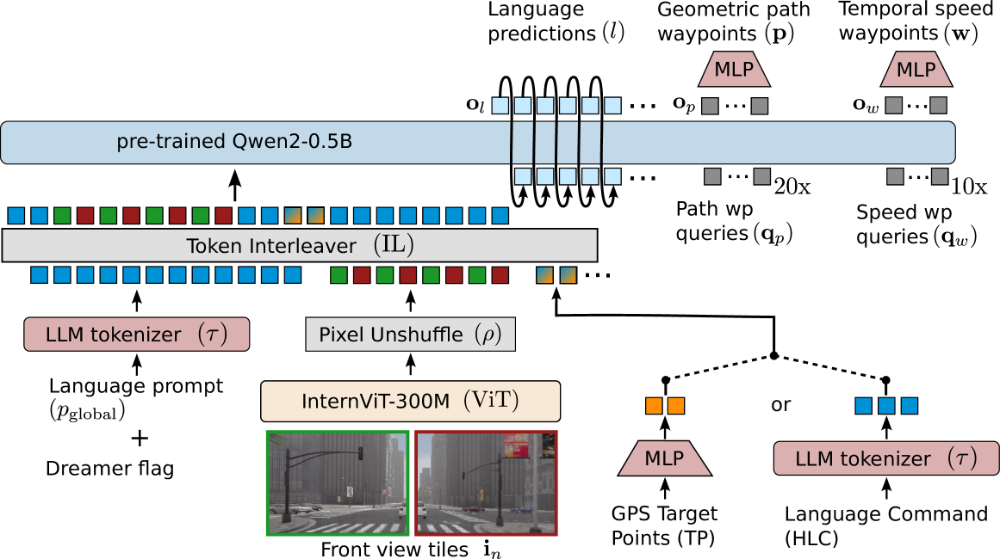

# VLA

## simlingo

### architectural design

- encode the image, navigational conditioning and the language prompt. 
- To encode high-resolution images, we split them into tiles, and encode each independently to reuse the pre-trained image encoder pre-trained on 448x448 resolution. 
- All embeddings get processed by an LLM which we finetune with LoRA to predict language and actions. 
- The action output utilizes a disentangled representation with both **temporal speed waypoints** and **geometric path waypoints** for improved lateral control.

[CN]
- 编码图像、导航条件和语言提示。
- 为了编码高分辨率图像，我们将它们分成多个块，并独立编码每个块，以重用预训练的图像编码器，该编码器在448x448分辨率上预训练。
- 所有嵌入都由一个LLM处理，我们使用LoRA进行微调，以预测语言和动作。
- 动作输出利用了一个解耦的表示，具有**时间速度航点**和**几何路径航点**，以提高横向控制。

### Vision-Language Understanding.

the final driving model acts in a Chain-of-Thought setting, where first the action and reason are predicted in language space, and then the action is predicted, conditioned on the generated commentary. 

[CN]
最终的驾驶模型在一个Chain-of-Thought设置中运行，首先在语言空间中预测动作和原因，然后在生成的评论的条件下预测动作。

### Action Dreaming

combines vision-language understanding with the ability to align it with the action space. We task the model with a wide variety of instructions including change of speed, lane changes, driving towards specific objects, or other navigational changes.

This tests whether the model’s language capabilities are aligned with the action space.

[CN]
结合了视觉语言理解和将其与动作空间对齐的能力。我们给模型布置了各种各样的指令，包括改变速度、变道、朝特定物体驾驶或其他导航变化。这测试了模型的语言能力是否与动作空间对齐。

#### output

(1) temporal speed waypoints 𝐰∈ℝ^Nwx2, with Nw future coordinates with *one coordinate every 0.25 seconds*. This represents the location of the ego vehicle at a specific time in the future. Also, we predict (2) geometric path waypoints 𝐩∈ℝNp×2, with Np future coordinates with *one coordinate every meter*. This represents future positions of the ego vehicle independently of the time to reach them. From the temporal waypoints 𝐰 we obtain a **target speed** and from the geometric waypoints 𝐩 a **target angle**. We then use two **PID controllers** to get the *steering angle and acceleration*. 

[CN]
(1) 时间速度航点 𝐰∈ℝ^Nwx2，具有Nw个未来坐标，每0.25秒一个坐标。这表示未来特定时间的自车位置。我们还预测(2) 几何路径航点 𝐩∈ℝNp×2，具有Np个未来坐标，每米一个坐标。这表示自车的未来位置，与达到它们的时间无关。从时间航点𝐰中，我们获得一个**目标速度**，从几何航点𝐩中获得一个**目标角度**。然后我们使用两个**PID控制器**来获得*转向角和加速度*。

To enable more efficient action prediction we predict all action embeddings in one forward pass instead of auto-regressively. For this, we input learnable query tokens 𝐪p and 𝐪w. An MLP on top of the output features 
[𝐨p,𝐨w] generates waypoint differences. The cumulative sum of these differences yields the final waypoints 𝐩 and 𝐰.

[CN]
为了实现更高效的动作预测，我们在一个前向传播中预测所有动作嵌入，而不是自回归地预测。为此，我们输入可学习的查询令牌𝐪p和𝐪w。输出特征上的一个MLP
[𝐨p,𝐨w]生成航点差异。这些差异的累积和产生最终的航点𝐩和𝐰。

### (1) closed-loop driving, 

### (2) vision-language understanding, 

### and (3) language-action alignment

Bootstrap: docker
From: quay.io/condaforge/miniforge3:25.3.1-0

%files
    environment.yml

%post
    /opt/conda/bin/conda env update --name base --file environment.yml --prune

apptainer build --fakeroot --tmpdir /scratch/$USER simlingo.sif simlingo.def

apptainer build my_container.sif my_recipe.def

## Roofline model:

Roofline model是一个以吞吐量为导向的性能模型。

主要概念：

**Peak flops**: 处理器的理论最大计算能力，单位为每秒浮点运算次数（FLOPS）。

**Bandwith**: GB/s

**Arithmetic intensity**: 每个字节数据所需的计算量，单位为FLOPS/byte。

物理意义上来说，是峰值计算性能和数据移动速度。

Attainable performance = min(Peak flops, Bandwidth * Arithmetic intensity)

Arithmetic intensity = FLOPS / Bytes