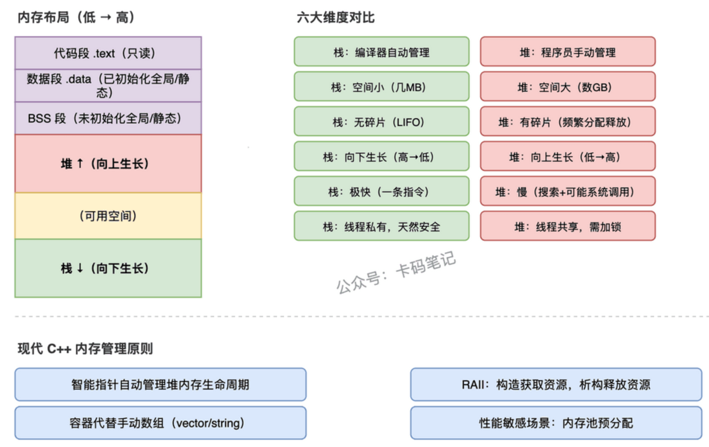

# 1 C++基础知识点总结

一般来说，面向对象里的对象是class的实例(包括了可能存在的封装、继承、多态等特性)，面向过程里的对象是struct的实例。struct默认public，class默认private。

## 指针vs引用
``` cpp
   // 引用示例    
   const int ci = 10;  
   //int& r = ci;  // 错误：非const引用不能绑定到const对象
   const int& cr = ci;  //正确：const引用可以绑定到const对象
    //指针示例
   int a = 10;
   const int* p1 = &a;  // p1指向的值是const的
   //*p1 = 20;  //错误：不能通过p1修改a的值
   int* const p2 = &a;  // p2本身是const的，不能改变指向
   //p2 = &b;  //错误：不能改变p2指向的对象
```

## static用法

1. 在函数内初始化
2. 函数或变量，仅当前文件可见，`extern`无法引用
3. 类共享（Utility,Factory等设计模式）
``` cpp
class MyClass {
public:
   static int staticVar;  // 声明静态成员变量
};
int MyClass::staticVar = 0;  // 类外定义并初始化静态成员变量
```
或
``` cpp
class MyClass {
public:
   static int add(int a, int b) {
      return a + b;
   } 
};
int x = MyClass::add(3, 4);  // 调用静态成员函数
MyClass myObj;
int y = myObj.add(5, 6);  // 也可以通过对象,但本质还是类调用，并不依赖对象实例
```

## define vs typedef
``` cpp
#define PI 3.14159  // 预处理器宏定义，文本替换
typedef int MyInt;  // 类型别名，编译器理解为MyInt是int的别名
inline int add(int a, int b) {
   return a + b;
}// 内联函数，编译器会尝试将函数调用替换为函数体代码，减少函数调用开销,不能递归、循环、过多条件判断等等。
```
## new vs malloc
``` cpp
int* p1 = (int*)malloc(sizeof(int));  // malloc分配内存，返回void*，需要强制类型转换
*p1 = 10;  // 使用malloc分配的内存需要手动初始化
int* p2 = new int;  // new分配内存，返回正确类型的指针，并调用构造函数（如果是类对象）
*p2 = 20;
delete p2;  // 使用new分配的内存需要使用delete释放，调用析构函数（如果是类对象）
free(p1);  // 使用malloc分配的内存需要使用free释放
```

## volatile关键字
``` cpp
for(volatile int i=0; i<100000; i++); // 它会执行，不会被优化掉  
```
通常用在多线程编程中，告诉编译器该变量可能被多个线程修改，禁止对其进行优化，确保每次访问都从内存中读取最新值.

## 线程安全

### thread, processor and program
- thread: 线程，是程序执行的最小单位，一个程序可以有多个线程同时执行。
- processor: 处理器，计算机的核心组件，负责执行指令和处理数据。一个processor可以有多个核心，每个核心可以同时执行一个线程。processor是一个物理概念，抽象为操作系统中的调度单位。
- program: 程序，是一组指令的集合，告诉计算机如何执行特定任务。
- process: 进程，是程序的一个实例，包含程序代码和当前活动的状态（如寄存器、内存等）。一个程序可以有多个进程，每个进程可以有多个线程。

线程共享程序的内存空间和资源，但每个线程有自己的执行上下文（如寄存器、堆栈等）。处理器可以同时执行多个线程，具体取决于处理器的核心数量和调度算法。

processor通过时间片轮转等调度算法来管理线程的执行，确保每个线程都有机会运行。程序中的线程可以通过同步机制（如互斥锁、条件变量等）来协调访问共享资源，避免竞争条件和死锁等问题。

affinity: 线程亲和性，指的是将线程绑定到特定的处理器核心上，以提高性能和减少上下文切换的开销。

### std::atomic

``` cpp
#include <atomic>
std::atomic<int> counter(0);  // 定义一个原子整数，初始值为0
counter++;  // 原子操作，线程安全的递增
// linux中不能直接对counter进行操作
counter.fetch_add(1);  // 原子操作，线程安全的递增
```


# 2 多态问题

## 函数指针

函数指针是指向函数的指针变量。它可以用于存储函数的地址，允许在运行时动态选择要调用的函数。

``` cpp
#include <iostream>
using namespace std;
// 定义一个函数指针类型
typedef void (*FuncPtr)();
// 定义两个函数
void funcA() {
    cout << "Function A" << endl;
}
void funcB() {
    cout << "Function B" << endl;
}
int main() {
    // 定义一个函数指针变量，并指向funcA
    FuncPtr ptr = funcA;
    ptr();  // 调用funcA，输出 "Function A"
    // 将函数指针指向funcB
    ptr = funcB;
    ptr();  // 调用funcB，输出 "Function B"
    return 0;
}
```

`加减`:
``` cpp
int add(int a, int b) {
    return a + b;
}
int subtract(int a, int b) {
    return a - b;
}
int main() {
   int (*operation)(int, int);  // 定义一个函数指针，指向返回int、参数为两个int的函数
   operation = &add;  // 将函数指针指向add函数
   int result = operation(5, 3);  // 调用add函数，result = 8
   cout << "Addition: " << result << endl;  // 输出
   operation = &subtract;  // 将函数指针指向subtract函数
   result = operation(5, 3);  // 调用subtract函数，result = 2
   cout << "Subtraction: " << result << endl;  // 输出
   return 0;
}
```

场景
- 回调： 将函数指针作为参数传递给另一个函数，在特定事件发生时调用
- 函数指针数组：循环或条件调度多个函数
``` cpp
#include <iostream>
using namespace std;
// 定义三个函数
void funcA() {
    cout << "Function A" << endl;
}
void funcB() {
    cout << "Function B" << endl;
}
void funcC() {
    cout << "Function C" << endl;
}
int main() {
    // 定义一个函数指针数组，存储三个函数的地址
    void (*funcArray[3])() = {funcA, funcB, funcC};
    // 通过循环调用函数指针数组中的函数
    for (int i = 0; i < 3; i++) {
        funcArray[i]();  // 输出 "Function A", "Function B", "Function C"
    }
    return 0;
}
```
- 动态加载库：在运行时加载动态库，并通过函数指针调用库中的函数
- 参数
- 函数映射表
- **多态实现**：虚函数和函数指针结合可以实现多态行为。

## 虚函数

# 3 问题

## 局部变量、全局变量、静态变量

- 局部变量（local variable）：定义在函数/代码块内，作用域限于该块，生命周期随栈帧创建和销毁，存储在栈区，未初始化时值不确定（随机值）。
- 全局变量（global variable）：定义在所有函数外，作用域为整个翻译单元（加 extern 可跨文件），生命周期贯穿整个程序，存储在数据段（已初始化）或 BSS 段（未初始化/零初始化），默认零初始化。
- 静态变量（static variable）：定义在函数内用 static 修饰，作用域限于该函数（外部不可访问），但生命周期贯穿整个程序，存储在数据段/BSS 段，只在第一次执行到定义语句时初始化一次，之后保持上次的值。

## 进程和线程的区别

## 堆和栈的区别

C++ 进程的内存从低地址到高地址依次是：

- 代码段（.text）：存放机器指令，只读
- 数据段（.data）：已初始化的全局变量和静态变量
- BSS（Biggest Segment Segment）：未初始化的全局变量和静态变量（自动清零）
- 堆：向上生长，程序员手动管理（new/delete），空间大但效率低
- 栈：向下生长，编译器自动管理，空间小但效率极高
堆和栈的核心区别：栈是编译器自动管理的高效内存，适合生命周期短、大小固定的局部变量；堆是程序员手动管理的大容量内存，适合生命周期长、大小动态变化的对象。

1. **管理方式**: 栈由编译器自动分配和释放（函数进入时压栈，返回时弹栈）。堆由程序员通过 new/delete 手动管理，忘记释放就是内存泄漏。
2. **栈空间很小**（Linux 默认 8MB，Windows 默认 1MB），超出就栈溢出。堆空间很大（数 GB），几乎不受限制。
3. **碎片问题**：栈不会产生碎片——因为是严格的后进先出，内存总是连续释放。堆频繁 new/delete 会产生碎片——中间释放的小块无法被大块请求利用。
4. **生长方向**：栈向低地址生长（从高往低压），堆向高地址生长（从低往高分配）。两者相向而行，中间是可用空间。
5. **分配效率**：栈分配只需移动栈指针（一条 CPU 指令），极快。堆分配需要在空闲链表中搜索合适大小的块，还可能触发系统调用扩展内存，慢得多。
6. **线程安全**：每个线程有自己独立的栈，天然线程安全。堆是所有线程共享的，多线程同时 new/delete 需要加锁（这也是堆分配慢的原因之一）。

> 压栈帧：是指函数调用时在栈上分配的内存块，用于存储函数的局部变量、参数和返回地址。每次函数调用都会创建一个新的栈帧，函数返回时栈帧被销毁。因此递归调用时，每次调用都会创建一个新的栈帧，直到达到栈的最大深度，可能导致栈溢出。

> 栈对象在作用域结束时自动析构，堆对象必须手动 delete 才析构。地址稳定性不同：堆对象的地址在整个生命周期内不变（适合被指针引用），栈对象的地址在函数返回后失效（不能返回局部变量的指针）。拷贝语义不同：栈对象赋值是值拷贝，堆对象通常通过指针传递（避免拷贝开销）。

### 堆分配为什么比栈慢？

三个原因：一是需要在空闲链表中**搜索**合适大小的内存块（O(n) 复杂度）；二是**多线程**环境下需要加锁保护堆的数据结构；三是如果空闲空间不够，需要通过 **brk/mmap 系统调用**向内核申请新页面。而栈分配只需要一条指令修改栈指针寄存器（ESP/RSP），O(1) 完成。

### 实际项目中怎么管理堆内存？

尽量不手动 new/delete。用智能指针（unique_ptr、shared_ptr）自动管理生命周期；用容器（vector、string）代替手动数组；遵循 **RAII** 原则——**资源在构造时获取，在析构时释放**。如果性能敏感（比如游戏引擎、高频交易），可以用内存池预分配一大块堆内存，避免频繁的系统调用和碎片。

## 智能指针

智能指针是C++11引入的特性，用于管理动态分配的内存。它们提供了自动内存管理的功能，避免了手动管理内存的复杂性和潜在错误。

### std::unique_ptr

`std::unique_ptr` 是一个独占所有权的智能指针，它确保同一时间只有一个指针指向动态分配的内存。当 `std::unique_ptr` 被销毁时，它会自动释放所指向的内存。

``` cpp
#include <memory>
std::unique_ptr<int> ptr(new int(10));  // 创建一个unique_ptr，指向动态分配的int
*ptr = 20;  // 修改指向的值
// 当ptr离开作用域时，自动释放内存
```

### std::shared_ptr

`std::shared_ptr` 是一个共享所有权的智能指针，它允许多个指针同时指向同一个动态分配的内存。当最后一个 `std::shared_ptr` 被销毁时，它会自动释放所指向的内存。

``` cpp
#include <memory>
std::shared_ptr<int> ptr1(new int(10));  // 创建一个shared_ptr
std::shared_ptr<int> ptr2 = ptr1;  // 复制shared_ptr，增加引用计数
*ptr1 = 20;  // 修改指向的值
// 当ptr1和ptr2都离开作用域时，自动释放内存
```

### std::weak_ptr

`std::weak_ptr` 是一个弱引用智能指针，它不增加引用计数。通常与 `std::shared_ptr` 结合使用，用于打破循环引用的问题。

``` cpp
#include <memory>
std::shared_ptr<int> ptr1(new int(10));  // 创建一个shared_ptr
std::weak_ptr<int> ptr2 = ptr1;  // 创建一个weak_ptr，不增加引用计数
// 当ptr1离开作用域时，ptr2将变为expired状态
```

# 4

- C++ 多态分两种：编译时多态靠函数重载和模板，编译期就确定调用谁；运行时多态靠 virtual 函数 + 继承 + 基类指针/引用，运行时通过 vptr → vtable → 函数地址 动态绑定到正确的实现。


| 问题          | 答案                                                                        |
| ----------- | ------------------------------------------------------------------------- |
| 每个子类都有虚表吗？  | **通常有**。只要该类拥有或继承虚函数，编译器通常会为它生成对应的虚表。                                     |
| 一个类有几个虚表？   | **通常一张**（每个动态类型对应一张虚表）。                                                   |
| 一个对象有几个虚指针？ | **通常一个**。但在**多重继承**等情况下，一个对象可能包含多个基类子对象，因此可能有多个 `vptr`。                   |
| 虚表存在哪？      | 一般具有静态存储期，常见实现放在只读数据段（如 `.rodata`）。                                       |
| 虚指针存在哪？     | 保存在对象内存中，主流实现通常放在对象起始位置。                                                  |
| 多态什么时候建立？   | 对象构造过程中，编译器会逐步更新 `vptr`：先指向基类虚表，进入派生类构造时再改为派生类虚表；对象构造完成后，虚函数调用才体现完整的动态类型。 |

- C++构造函数主要有六种：默认构造、参数化构造、拷贝构造、移动构造（C++11）、委托构造（C++11）、继承构造（C++11）。

核心区别在于触发时机和资源处理方式不同：默认构造负责零初始化，拷贝构造复制资源，移动构造转移资源所有权，委托构造复用初始化逻辑，继承构造透传基类初始化。

# DSA
## 哈希表

需要快速查找或记录元素，或判断出现频次

> std::unordered_set / std::unordered_map 是 C++ 中最常用的哈希结构，底层实现是哈希表，查询 O(1)，增删O(1);遍历 O(n)。
1. unordered_set
```cpp
unordered_set<int> s; // 存储整数的哈希集合
unordered_set<int> nums(nums.begin(), nums.end()); // 从 vector 初始化哈希集合
unordered_set<int> s2(s); // 从另一个哈希集合初始化
unordered_set<int> s3 = {1, 2, 3}; // 列表初始化哈希集合
s.insert(5); // 插入元素
if (s.count(5))  // 判断元素是否存在
if (s.find(5) != s.end()) // 判断元素是否存在
s.erase(5); // 删除元素
```


2. unordered_map
```cpp
std::unordered_map<std::string, int> m; // 存储字符串到整数映射的哈希映射
m["apple"] = 3; // 插入键值对
std::unordered_map<std::string, int> m2(m); // 从另一个哈希映射初始化
std::unordered_map<int, int> nums;
nums.insert({1, 100}); // 插入键值对
if (m.count("apple")) // 判断键是否存在
if (m.find("apple") != m.end()) // 判断键是否存在
m.erase("apple"); // 删除键值对
```

