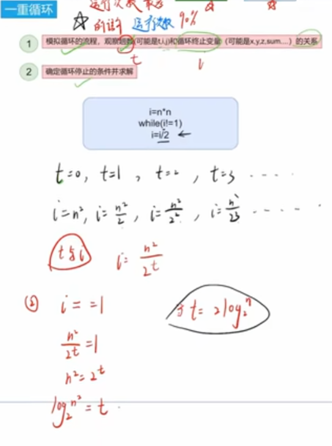
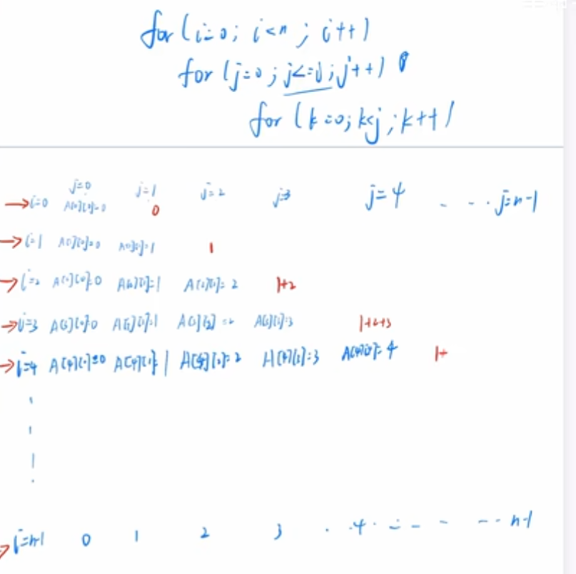
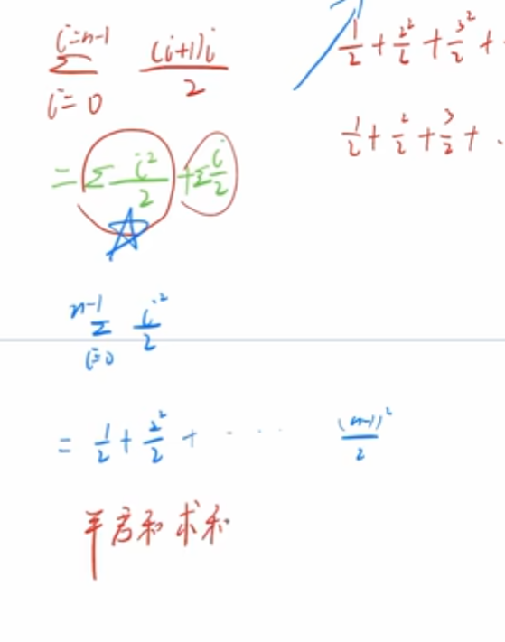
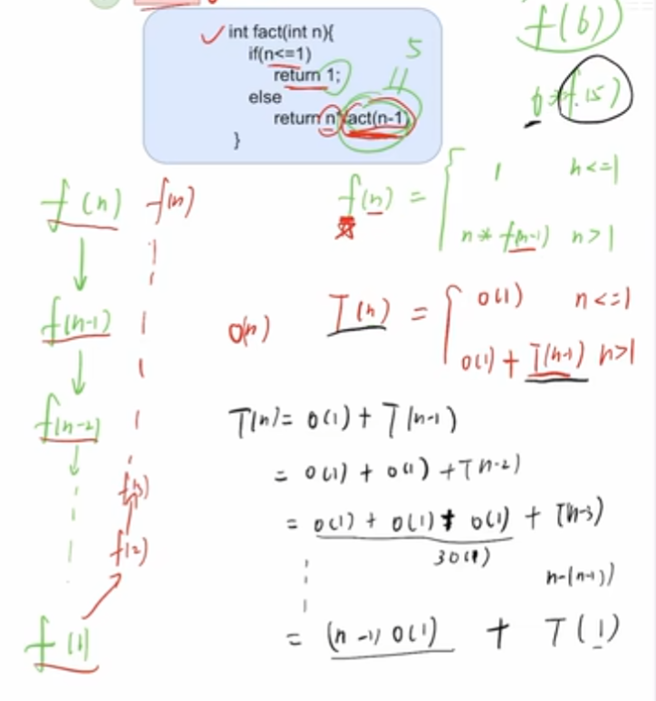

### 时间复杂度分析
#### 一重循环复杂度
1. 模拟循环流程，观察time和中止变量的关系；
2. 确定中止条件并求解。

#### 二重循环复杂度
1. 模拟循环值变化，列出外层的值变化
2. 列出内层循环的执行次数
3. 计算执行次数之和

#### 多重循环

#### 递归复杂度
1. 模拟递归，观察参数变化
2. 边界条件->递归深度
3. 递推公式

### 数据结构整体

栈-括号匹配，表达式，递归
队列-层次遍历，缓冲区