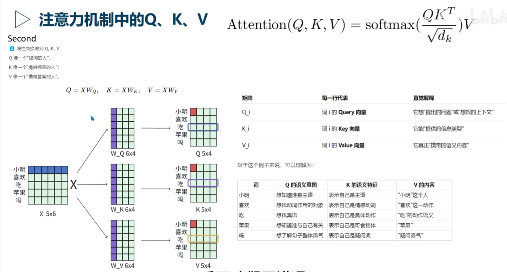
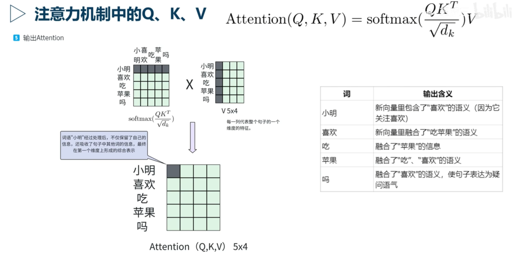
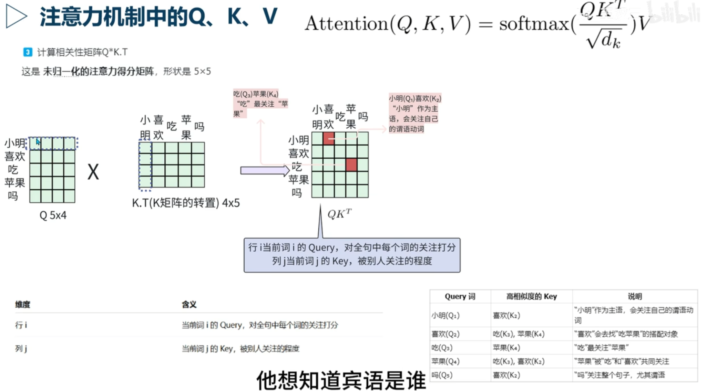
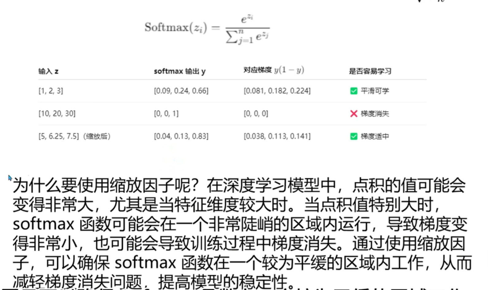
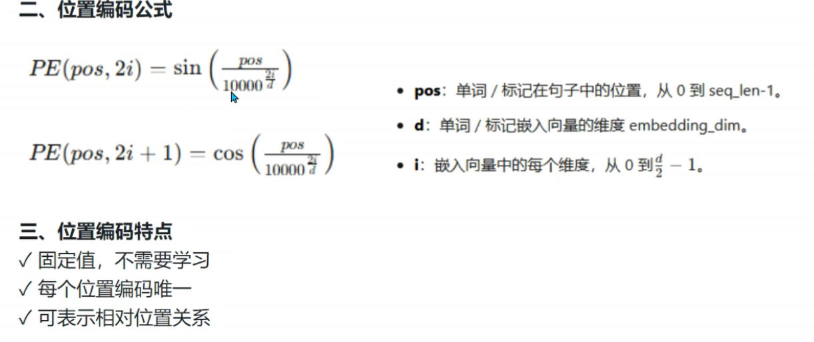

# QKV

自注意力：其实是每个token依次和其他token相乘。如果是两个不同的矩阵相乘，那就是两个句子的语义相似度，越大越相似。

Q : Query, 想找的上下文
K : Key, 上下文的标识，用来匹配Q, 表示提供的信息类型
V : Value, 上下文的内容，真正提供的语义内容

Attention = softmax(QK^T / sqrt(d_k))V

QK^T / sqrt(d_k) 是一个相似度矩阵，表示每个token与其他token的相似度。然后通过softmax函数将相似度矩阵转换为权重，最后乘以V得到最终的输出。

这其中，QK^T 的含义是：对于每个token的Query，计算它与所有token的Key的相似度。这个相似度可以理解为每个token与其他token的关系强弱程度。（i，j）表示的就是第i个token关注第j个token的程度，还是数值越大，说明第i个token越关注第j个token。

然后通过除以sqrt(d_k)进行缩放，防止相似度过大导致softmax函数的梯度消失问题。

然后通过softmax函数将这些相似度转换为权重。

再与V乘回去，V的维度由其他方式决定，来表示不同维度的语义特征。最终得到的结果是V的维度，如图。经过整个处理后，每个token都得到了自己和其他token的关系权重，并且通过这些权重对V进行加权求和，得到最终的输出。

整个得出的矩阵就是`注意力得分矩阵`

# 缩放点积注意力

对于图中的公式，从数学角度来看，如果输入的点积值过大，$ softmax = \frac{e^{x_i}}{\sum_j e^{x_j}} $ 不是趋近1就是趋近0，导致梯度消失。

通过除以 $\sqrt{d_k}$ 进行缩放，可以缓解这个问题。

# 多头注意力机制

每个头学习不同信息。
一般是8个头，每个头的维度是512/8=64

# Transformer

encoder-decoder结构，encoder和decoder都是由多个相同的层堆叠而成，每层包含多头注意力机制和前馈神经网络。

1. 编码器输入

输入的嵌入
input embedding
位置编码
pos embedding

2. 编码器层

每层包含多头注意力机制和前馈神经网络。
multi-head attention; forward 
多头注意力机制：每个头学习不同的信息，最终将多个头的输出进行拼接和线性变换。残差连接和层归一化。

前馈神经网络：包含两个线性变换和一个激活函数。残差连接和层归一化。

残差连接：将输入直接添加到输出中，帮助缓解梯度消失问题。

层归一化：对每个样本进行归一化，帮助稳定训练过程。

3. 解码器输入

解码器输入：目标序列的嵌入和位置编码。

4. 解码器层

掩码多头注意力，残差连接和层归一化。

编码器-解码器多头注意力，残差连接和层归一化。

前馈神经网络，残差连接和层归一化。

5. 训练和推理

训练：教师强制，使用目标序列的真实值作为输入。
推理：自回归，使用模型生成的输出作为输入。

 
## embedding

PAD: 使所有输入序列具有相同长度的特殊标记。
SOS: 序列开始标记，表示输入序列的开始。
EOS：序列结束标记，表示输入序列的结束。

怎么把句子转换成向量？embedding就是把离散的单词映射到连续的向量空间中。

